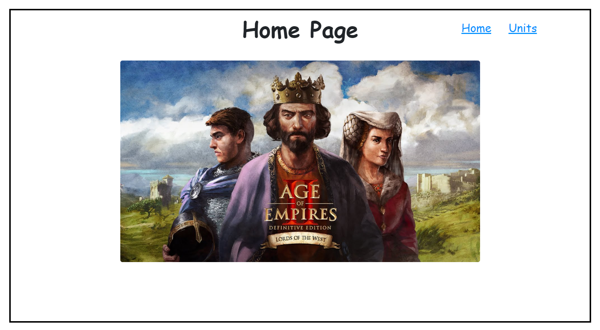
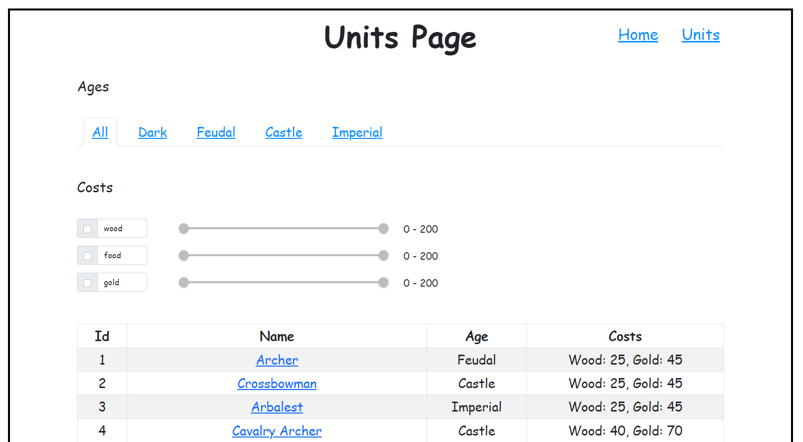
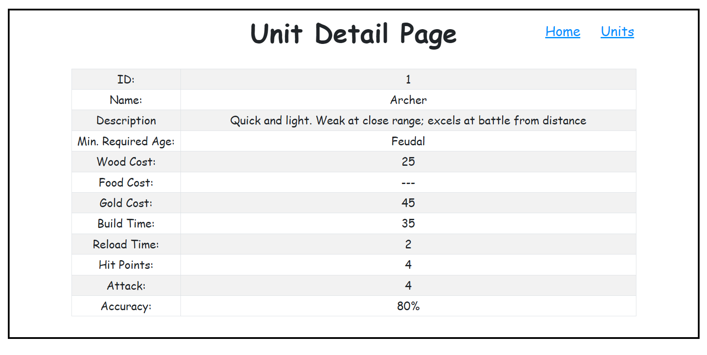

# Age of Empires 2 Units With React

### Steps to run the project after downloading.
Write to terminal.
1. npm install
2. npm start

### Technologies that used in the project.

* ReactJS
* React-Redux
* Redux-Saga
* React Router
* React Bootstrap
* React MUI
* ESlint
* SASS-Scss

### In this project, some units in Age of Empires 2 are listed in detail.

#### Screenshots

#### Home Page

#### Units Page

#### Unit Details Page
